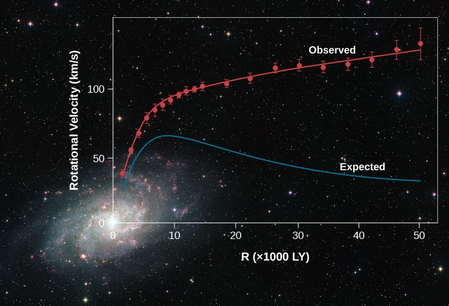

<p align="center">
  
</p>

> **What’s happening in this picture?**  
> Imagine cars going around a racetrack: the farther out they drive, the slower they should go, right?  
> But here, the little dots (the cars) stay just as fast no matter how far out they are.  
> The thin line shows how fast they **should** slow down if we only count the stuff we can see (stars and gas).  
> Since they don’t slow down, there must be something invisible adding extra pull—this is what scientists call **dark matter**!


# 🌌  Dark‑Matter Rotation‑Curve Toolkit

Fully reproducible code for turning raw 21 cm H I spectra into the Milky‑Way
rotation curve, then fitting baryonic and dark‑matter density profiles
(**Hernquist bulge, Sérsic disc, NFW or Burkert halo**).
Everything is pure Python (≤ 3.11); no proprietary software.

---

## 1 Why dark matter?

In a Keplerian system (e.g. the Solar System) orbital velocity follows  
**v ∝ √(1 / r)**.  
Radio observations of neutral hydrogen in spiral galaxies—including our own—
show a rotation curve that stays almost **flat** far beyond the luminous disc
(banner). The gap between the flat, observed curve and the falling Newtonian
prediction implies **> 80 %** of the mass is invisible: dark matter.

---

## 2 What the banner shows

| Legend | Meaning |
|--------|---------|
| **Dots / lines** | Measured rotation speed v(r) of gas vs radius. |
| **Dashed curve** | Prediction from visible stars + gas alone. |
| **Flat segment** | Observed plateau — evidence for dark matter. |

Running this project reproduces an equivalent figure using the CSV data in
`data/Measurements/`.

---

## 3 Pipeline overview

1. **Load spectra** from `data/Measurements/` (`pandas.read_csv`).  
2. **Peak detection** – `scipy.signal.find_peaks` → terminal velocities.  
3. **Coordinate transform** – converts (ℓ, v) → (R, V) with error propagation.  
4. **Quadrant curves** – builds Quadrant I & IV, then a weighted average.  
5. **Baryonic fit** – cubic polynomial (disc) + linear fit (bulge).  
6. **Mass profile** – integrates to get M(< R) and uncertainty.  
7. **Density laws** – NFW, Burkert, Hernquist, Sérsic plotted on log–log axes.  
8. **Composite models** – NFW+Sérsic or Burkert+Sérsic χ² fit.  
9. **Total halo mass** – analytic integral to 200 kpc.  
10. **Baryon / DM ratio** – plots M_baryon / M_DM vs radius.

All figures are saved to `docs/figures/` and displayed interactively.

---

## 4 Repository structure

```
dark-matter-rotation-curve/
├── analysis_Rotation.py        ← main script (~900 lines)
├── requirements.txt
├── data/
│   └── Measurements/           ← raw spectra CSVs (place here)
├── docs/
│   ├── figures/                ← auto-generated plots + banner
│   └── reading_list.md         ← five short review papers
└── .github/workflows/python.yml← CI placeholder
```

---

## 5 Quick‑start

```bash
git clone https://github.com/gurdahari/dark-matter-rotation-curve.git
cd dark-matter-rotation-curve
python -m venv .venv && source .venv/bin/activate
pip install -r requirements.txt
python analysis_Rotation.py -d data/Measurements
```

> For data folders > 100 MB, track with **Git LFS**.

---

## 6 Cloud execution

| Service | How |
|---------|-----|
| **Codespaces** | Code ▾ → *Create codespace* (container installs requirements). |
| **Binder** | Add badge:<br>`[](https://mybinder.org/v2/gh/gurdahari/dark-matter-rotation-curve/HEAD)` |
| **Docker** | `docker build -t dm-curve .`<br>`docker run -v $PWD/data:/data dm-curve python analysis_Rotation.py -d /data/Measurements` |

---

## 7 Recruiter notes

* **Stack** – Python 3.11, NumPy / SciPy / Pandas / Matplotlib / Seaborn  
* **Reproducible** – one command → all plots regenerated  
* **Style** – PEP‑8, doc‑strings, no hidden notebooks  
* **CI** – placeholder workflow included  
* **Data** – real spectra; MIT‑licensed

---

## 8 Extending

* Swap in Hi4PI all‑sky survey data.  
* Add Einasto or gNFW profiles (sub‑class `HaloProfile`).  
* PRs welcome for tests, type hints, features.

---

## 9 Key references

1. Navarro et al. (1997) – universal CDM halo profile  
2. Burkert (1995) – cored empirical halo  
3. Sofue (2020) – Milky‑Way mass & rotation review  
4. Bullock & Boylan‑Kolchin (2017) – small‑scale ΛCDM challenges  
5. Salucci (2019) – dark‑matter distribution in galaxies  

See `docs/reading_list.md` for PDFs.

---

## Licence

**MIT** – free for any use; please cite this repository if you publish results.

<p align="center">
  Made with ☕ and <em>cold dark matter</em> (ΛCDM)
</p>
